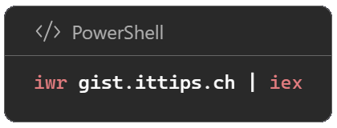

# GIST - Gist Intune Script Trigger

<p align="center">
  
</p>

---

***<p style="text-align: center;">« Gist Intune Script Trigger, a recursive acronym if you get the gist of it »</p>***

---

## Overview

***Gist Intune Script Trigger*** is a compilation of concise PowerShell scripts designed for diagnosing and troubleshooting primarily Intune devices. These scripts have been organized into a menu for ease of use, accessible with a simple and memorable command: ```iwr gist.ittips.ch | iex```.

- ```iwr``` alias for Invoke-WebRequest,
- ```gist.ittips.ch``` is pointing to ```GistIntuneScriptTrigger.ps1``` in this repository
- ```|``` piped to
- ```iex``` is alias to Invoke-Execution.

#### Prod

```powershell
iwr gist.ittips.ch | iex
```

#### Dev ⚡danger zone ⚡

```powershell
iwr gist.ittips.ch/dev | iex
```

#### Direct script call with gist number

```powershell
iwr gist.ittips.ch/5 | iex
```

## Contribute

If you are the **author** of a script that you would like to add, create an issue [New script / gist](https://github.com/MrWyss-MSFT/gist/issues/new?assignees=&labels=new+script&projects=&template=new-script.md&title=New+Script%3A+%5BYourScriptName%5Dissues/new/choose). If the script passes the **script requirements**, I will add the specific **gist id** and **revision id** to the menu.

### Script Requirements

- Script is **not harmful**
- Script **does not** change system settings
- Script **does not** depend on external components (e.g. Modules, other scripts, radom content from the internet)
- Does **not require parameters** (as for now)

Any other suggestions, issues and such:  [Issue](https://github.com/MrWyss-MSFT/gist/issues/new/choose)
